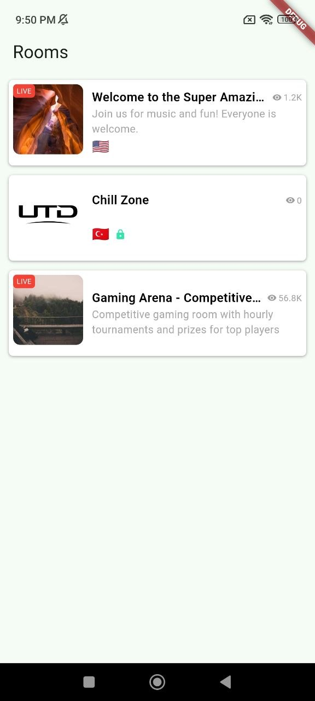
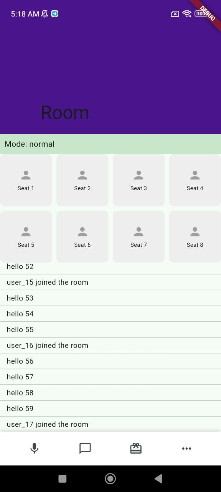

# Flutter Developer Assessment Solution

## 👨‍💻 Developer Information

**Developed and Submitted by:**

| Field | Details |
|-------|---------|
| **Name** | Eyad Khaled |
| **Title** | Senior Flutter Developer |
| **Phone** | +201024537220 |
| **Email** | khaledeyad60@gmail.com |
| **LinkedIn** | [www.linkedin.com/in/eyad-khaled](https://www.linkedin.com/in/eyad-khaled) |

---

## 📁 Project Structure

```
flutter-developer-assessment-solution/
├── lib/           # Flutter application source code
├── exercises/     # Assessment exercise files
├── answers/       # Submitted answers, reports, screenshots
└── questionnaire/ # Interactive questionnaire
```

---

## 🎯 Exercises Overview

| # | Exercise | Type | Focus |
|---|----------|------|-------|
| 1 | Room Card Widget | Code | UI Widget Development & Debugging |
| 2 | Paginated Room List | Code | BLoC State Management & Pagination |
| 3 | Room Screen Debugging | Code | Multi-Bug Debugging & Problem Solving |
| 4 | DI Service Refactor | Code + Written | Dependency Injection Patterns |
| 5 | Performance Audit | Code + Written | Performance Optimization & Analysis |
| 6 | Video Walkthrough | Video | Live Debugging Demonstration |
| 7 | Visual Bug Hunt | Run & Report | Manual QA Testing & Bug Detection |
| 8 | Product Decisions | Written | Architectural Decision Making |

---

## 🖼️ Exercises Demo Table (Screenshots & Videos)

| Exercise | Demo Screenshot | Demo Video |
|----------|----------------|------------|
| 1 |  | — |
| 2 | — | [Watch Video](answers/screenshots/exercise_2.mp4) |
| 3 |  | — |
| 6 | — | [Watch Video](https://www.loom.com/share/3cb5fcf80fb04478971afdcaf8fc796d) |


---

## 📂 Detailed Directory Structure

### `exercises/` — Assessment Exercise Files
```
exercises/
├── exercise_1_room_card.dart        # Exercise 1: Fix & improve Room Card widget UI
├── exercise_2_room_list_bloc.dart   # Exercise 2: Fix BLoC pagination bugs
├── exercise_3_room_screen_mini.dart # Exercise 3: Find and fix 8 intentional bugs
├── exercise_4_di_snippet.dart       # Exercise 4: Refactor DI anti-patterns
├── exercise_5_performance_analysis.dart  # Exercise 5: Performance audit analysis
├── exercise_6_video_walkthrough.md  # Exercise 6: Video walkthrough instructions
├── exercise_7_live_app_interaction.md    # Exercise 7: Visual bug hunt guide
└── exercise_8_product_decisions.md  # Exercise 8: Architecture decision scenarios
```
**Description:** Contains 8 practical Flutter development exercises covering:
- UI widget development and debugging
- State management with BLoC pattern
- Code quality and performance optimization
- Dependency injection patterns
- Product decision-making and architecture

---

### `answers/` — Assessment Submission Files
```
answers/
├── questionnaire_answers.json       # Questionnaire responses (JSON format)
├── scenario_1_offline_chat.md       # Architecture decision: Offline chat feature
├── scenario_2_refactor_decision.md  # Architecture decision: Code refactoring strategy
├── scenario_3_migration_proposal.md # Architecture decision: Migration proposal
├── visual_bugs_report.md            # Report of visual bugs found during testing
└── screenshots/                     # Supporting screenshots of bugs
```
**Description:** Contains all assessment answers and submissions:
- Structured questionnaire responses
- Architecture and design decision documents
- Bug reports with evidence

---

## � Notes Recognized While Working

### Exercise 1: Widget Organization
**Issue:** Reusable widgets are defined within the same file for reference purposes.
**Recommendation:** Extract reusable widgets into separate dedicated files to improve modularity, maintainability, and code reusability across the project.

---

### Exercise 2: State Management & Scroll Position
**Issue #1 - Import Conflict:** State class definition exists in both `dartz` and `flutter` packages, causing ambiguity when extending `State<RoomListPage>`.

**Issue #2 - Scroll Position Reset:** Pagination was resetting scroll position due to:
- **Stale state values:** The scroll listener read `currentPage` and `lastPage` values cached from `initState`, not the latest updated values.
- **ScrollController preservation:** The `copyWith` method had parameter shadowing, passing `null` instead of preserving the existing controller, causing scroll position loss on every state update.

**Solution:** Ensure listeners read fresh state values and properly preserve the ScrollController reference during state transitions.

---

### Exercise 3: Shrinkwrap Layout Constraint
**Issue:** Using `shrinkWrap: true` in the seat grid caused layout conflicts. Removing it triggered `FlutterError: Vertical viewport was given unbounded height.`

**Solution:** The constraint error occurs because the grid requires a bounded height from its parent. Resolution involves wrapping with `Expanded` or `SizedBox` to provide explicit height constraints while maintaining proper layout behavior.

---

### Exercise 4: Dependency Injection Layer
**Issue:** Application crashes on execution due to the DI layer using a mock class (`_MockDI`) containing hardcoded exceptions instead of functional implementation.

**Solution:** Replace mock implementation with actual service locator logic or proper dependency injection configuration to enable normal application flow.

---

## �🚀 Quick Start

### Prerequisites
- Flutter SDK installed
- Dart SDK (included with Flutter)
- VS Code, Android Studio, or IntelliJ IDEA

### Setup & Run
```bash
# Navigate to project directory
cd flutter-developer-assessment-solution

# Install dependencies
flutter pub get

# Run the application
flutter run
```


*Flutter Developer Assessment Solution | March 2026*
*Developed by: Eyad Khaled, Senior Flutter Developer*
